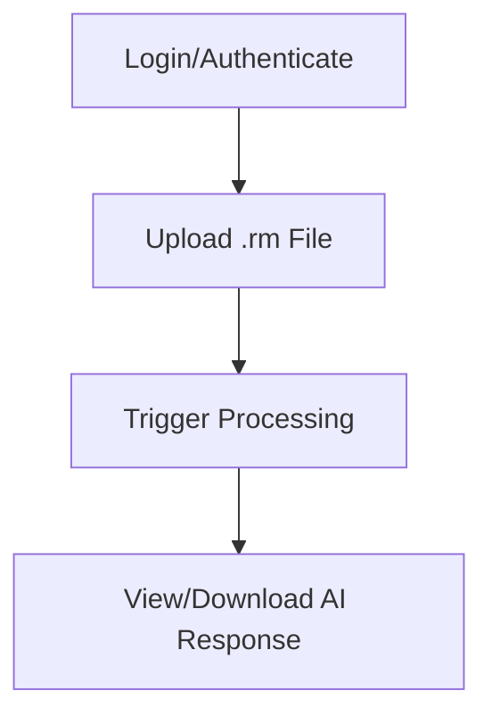

# InkLink Minimal Web UI Plan

## 1. Requirements

**Core Features:**
- Authenticate with reMarkable and MyScript (API key/HMAC entry, token storage)
- Upload `.rm` files
- Trigger round-trip processing (file → AI → markdown response)
- View/download AI-generated responses (markdown rendered and as raw file)

**Non-Functional:**
- Minimal, responsive UI
- Secure handling of credentials and files
- Clear error/status feedback

---

## 2. User Flows



**Steps:**
1. User authenticates with reMarkable and MyScript (enters API keys/tokens).
2. User uploads a `.rm` file.
3. User clicks "Process" to trigger round-trip.
4. UI shows processing status.
5. When ready, UI displays markdown-formatted AI response and provides download option.

---

## 3. High-Level Architecture

```mermaid
graph TD
    subgraph Web UI
        UI1[Login Form]
        UI2[File Upload]
        UI3[Process Button]
        UI4[Markdown Viewer/Download]
    end
    subgraph Backend API
        API1[/auth/remarkable]
        API2[/auth/myscript]
        API3[/upload]
        API4[/process]
        API5[/response]
    end
    UI1 -- POST /auth/remarkable, /auth/myscript --> API1 & API2
    UI2 -- POST /upload --> API3
    UI3 -- POST /process --> API4
    UI4 -- GET /response --> API5
```

---

## 4. Recommended Backend API Structure

### Authentication

- **POST /auth/remarkable**
  - Request: `{ "token": "..." }`
  - Response: `{ "status": "ok" }`
- **POST /auth/myscript**
  - Request: `{ "application_key": "...", "hmac_key": "..." }`
  - Response: `{ "status": "ok" }`

### File Upload

- **POST /upload**
  - Multipart/form-data: `.rm` file
  - Response: `{ "file_id": "..." }`

### Trigger Processing

- **POST /process**
  - Request: `{ "file_id": "..." }`
  - Response: `{ "status": "processing" | "done" | "error", "response_id": "..." }`

### Retrieve AI Response

- **GET /response?response_id=...**
  - Response: `{ "markdown": "...", "raw": "..." }`

---

## 5. Integration Points

- Web UI calls backend endpoints as above.
- Backend uses existing service classes for business logic.
- Credentials/tokens are stored securely (session or encrypted storage).
- AI response is rendered as markdown in the UI and available for download.